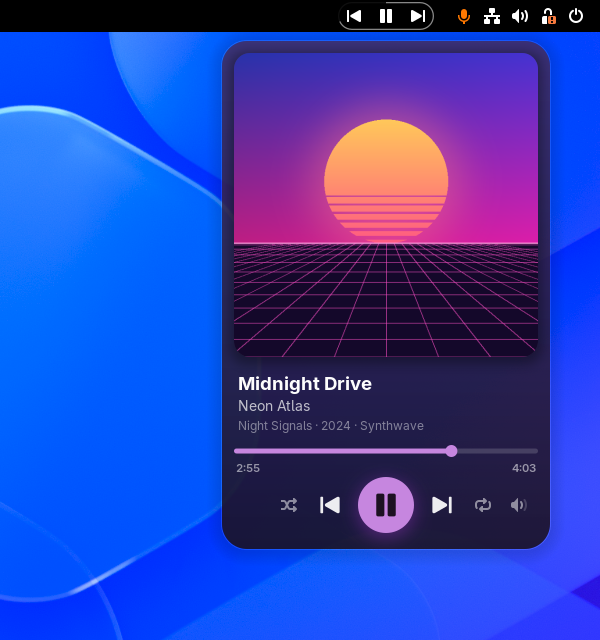
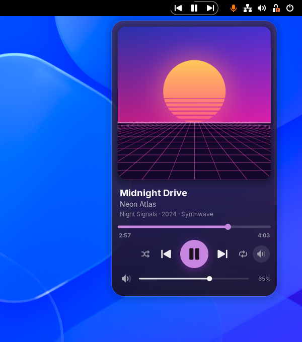
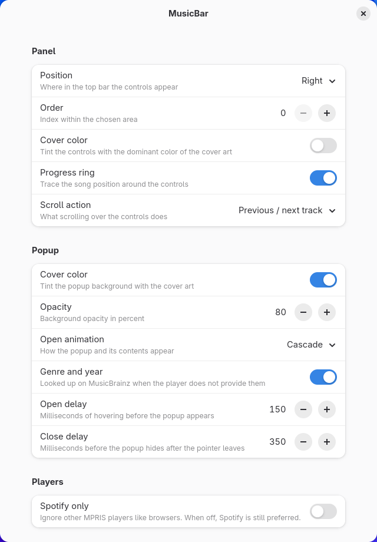

# MusicBar

Compact media controls for the GNOME Shell top bar that take on the colors of
the current cover art. Works with Spotify and any other MPRIS player.

<p align="center">
  
</p>

<p align="center">
  
  
</p>

## Features

**In the top bar**

- Previous, play/pause and next in a small pill. There's no track title, so the
  bar never shifts when the song changes.
- The song position is drawn as a thin ring around the pill.
- Scroll over the pill to skip tracks or seek (configurable).
- Fits the panel height, including tall [Dash to Panel](https://extensions.gnome.org/extension/1160/dash-to-panel/)
  bars and bottom panels.

**In the popup** (hover the pill)

- Large cover art that cross-fades between tracks. Click it to bring the player
  to the front.
- Title, artist and one quiet line with album, year and genre. Text that
  doesn't fit scrolls.
- A scrubber with elapsed and total time; click the total to show the remaining
  time instead.
- Shuffle, previous, play/pause, next and repeat (off / playlist / track).
- A volume button that folds out a slider with mute.
- The background gradient and accent color follow the cover.
- The windows behind the popup are blurred (can be turned off).
- Six open animations: Cascade, Spring, Sweep, Zoom, Fade or None.

**With your Spotify account** (optional, see [below](#spotify-account-features))

- Save the current song to Liked Songs.
- Add it to any of your playlists.
- See when Spotify's Smart Shuffle is on (a small sparkle on the shuffle button).

**Players**

Spotify is preferred. Other players (browsers, Rhythmbox, mpv, …) take over when
they are the one playing, unless **Spotify only** is switched on.

## Requirements

GNOME Shell 50 or 51.

## Installation

### From extensions.gnome.org

Install MusicBar from [extensions.gnome.org](https://extensions.gnome.org/), or
from the Extension Manager app.

### From source

```sh
git clone https://github.com/JorGra/musicbar.git
cd musicbar
make install
```

Log out and back in (on Wayland GNOME Shell can't be restarted in place), then:

```sh
gnome-extensions enable musicbar@jgproduction.com
```

## Settings

Open them from the Extensions app, or run
`gnome-extensions prefs musicbar@jgproduction.com`.

<p align="center">
  
</p>

| Group   | Setting         | What it does                                              |
|---------|-----------------|-----------------------------------------------------------|
| Panel   | Position, Order | Left, center or right part of the top bar, and the slot in it |
| Panel   | Cover color     | Tint the progress ring with the cover color               |
| Panel   | Progress ring   | Show the song position around the controls                |
| Panel   | Scroll action   | Previous / next track, seek, or nothing                   |
| Popup   | Cover color     | Tint the popup background with the cover art              |
| Popup   | Opacity         | Background opacity of the popup                           |
| Popup   | Blur            | Blur the windows behind the popup                         |
| Popup   | Open animation  | How the popup and its contents appear                     |
| Popup   | Genre and year  | Look them up on MusicBrainz when the player has none      |
| Popup   | Open / close delay | How long to hover before the popup opens or closes     |
| Players | Spotify only    | Ignore other MPRIS players                                |

## Spotify account features

Liking songs, adding them to playlists and showing Smart Shuffle use the
Spotify Web API. It needs your own free Spotify developer app:

1. Open the [Spotify Developer Dashboard](https://developer.spotify.com/dashboard)
   and create an app. Tick only **Web API**.
2. Add `http://127.0.0.1:8898/callback` as a redirect URI.
3. In MusicBar's settings, turn on **Like and add to playlists**, paste the
   Client ID and click **Connect**. Your browser opens to log in.

The buttons stay hidden until you connect. Spotify only lets development-mode
apps be used by a Premium account owner and up to five users you add in the
dashboard.

If you connected before Smart Shuffle support was added, click **Connect** once
more to grant the extra playback-state permission.

Smart Shuffle can only be shown, not switched on: Spotify's API has no way to
do that. Clicking shuffle while it is on turns shuffle off.

## Privacy and network access

MusicBar doesn't collect or send any usage data. It only goes online for:

- **Cover art.** It downloads the image the player points to (for Spotify,
  `i.scdn.co`) and caches it in `~/.cache/musicbar`.
- **Genre and year.** When the player doesn't provide them (Spotify never does),
  the artist, title and album are looked up on
  [MusicBrainz](https://musicbrainz.org/). Turn off **Genre and year** to
  disable this.
- **Spotify account features.** Only after you connect your own developer app.
  The login refresh token is stored in GSettings
  (`org.gnome.shell.extensions.musicbar spotify-refresh-token`).
  **Disconnect** in the settings removes it.

## Troubleshooting

- **The controls don't show up.** MusicBar hides itself while no MPRIS player is
  running. Check that your player shows up in
  `busctl --user list | grep mpris`.
- **No volume button.** The player doesn't allow volume control over MPRIS.
- **No genre or year.** MusicBrainz has no match for the track, or the lookup is
  turned off.
- **Logs:** `journalctl --user -f -o cat /usr/bin/gnome-shell | grep -i musicbar`

## Development

```sh
make dev        # nested GNOME Shell window running MusicBar from this folder
make dev-prefs  # open the settings inside that window
make pack       # build the extensions.gnome.org zip in build/
make lint       # ESLint (run `npm install` once first)
```

`make dev` uses GNOME's devkit (`gnome-shell --devkit`). The nested shell has
its own D-Bus session and keeps its settings in `build/devkit`, so your real
session and dconf stay untouched. `tools/mpris-relay.py` mirrors your real
players (Spotify) into it, so the controls drive the actual app. Close the
window and run `make dev` again to load code changes. Settings changes
(`prefs.js`) only need the settings window reopened.

## License

[GPL-3.0-or-later](COPYING). Spotify is a trademark of Spotify AB. MusicBar is
not affiliated with or endorsed by Spotify.
